<!--नेकी कर, GitHub पर डाल 🫡
-->
[](https://git.io/typing-svg)

```json
{
  "name": "Gaurav Singh",
  "role": "Full Stack Developer",
  "tagline": "Crafting Code, Creating Solutions",
  "status": "Building, Learning & Open to Opportunities",
  "location": "Lucknow, India",

  "education": {
    "diploma": "Diploma in Computer Science & Engineering",
    "btech": "Bachelor of Technology in Computer Science & Engineering"
  },

  "currently_learning": [
    "Backend Development",
    "System Design",
    "DevOps"
  ],

  "open_to": [
    "Full Stack Developer",
    "Frontend Developer",
    "Backend Developer"
  ],

  "welcome_msg": "Hello, World! Welcome to my digital space."
}
```

| 🌟 Let's Connect | 🧠 What I'm Learning & Writing | 🌍 Find Me Around the Web | 👀 Visitors |
|-------------------------|-------------------------------|--------------------------|-------------------|
| [](https://linkedin.com/in/gauravsingh7x) [](mailto:gauravsingh7x@outlook.in) [](https://www.gauravsingh.live/) | [](https://medium.com/@gauravsingh7x) [](https://dev.to/gauravsingh7x) | [](https://x.com/gauravsingh7x) [](https://instagram.com/gauravsingh7x) [](https://facebook.com/gauravsingh7x) |  |


<!--
<h2>⚡ Tech Stack & Engineering Arsenal</h2>
<table width="100%" align="center">
  <tr>
    <td width="50%" valign="top">
      <h3>💻 Languages</h3>
      
      <br/><br/>
      <h3>🎨 Frontend</h3>
      
      <br/><br/>
      <h3>⚙️ Backend</h3>
      
      <br/><br/>
      <h3>🗄️ Databases & Caching</h3>
      
      <br/><br/>
      <h3>☁️ Cloud & DevOps</h3>
          
    </td>
    <td width="50%" valign="top">
      <h3>🤖 Artificial Intelligence</h3>
      <p>
        
        
        <br/>Ollama • Llama 3.2 • Prompt Engineering • NLP • Deep Learning • Fine-Tuning • Structured Output • AI Agents • Intent Classification • AI Chatbots
      </p>
      <br/>
-->

## 💻 Tech Stack  
 
 
 

 


[](https://www.java.com/)

 
[](https://dotnet.microsoft.com/apps/aspnet/mvc)
[](https://nodejs.org/)

<!--


[](https://angular.dev/)
 
-->
## 🛠️ Tools
[](https://notepad-plus-plus.org/)


 


<!--


-->

<!-- GITHUB STATS 
GitHub Analytics & Open Source Activity

### 📈 GitHub Analytics
<div align="center" style="display: flex; justify-content: space-between;">
<p align="center" style="display: flex; justify-content: space-between;">
  
  &nbsp;&nbsp;&nbsp;&nbsp;&nbsp;&nbsp;&nbsp;
  
</p>
-->


 <p>
   
<!--  
  
-->
 </p>

 <p>
   <h2 align="center">The Snake ate my work as a Snack.🐍</h2>
   
 </p>

 <p align="center">
   
 </p>

</div>
<!--

-->


<!--
 
 
 
 


 
 
 


 
 
-->


<!--


https://github.com/lohithadamisetti123/
<table align="center" width="100%" border="0">
  <tr>
    <td align="center" width="50%" style="border: none; background: none;">
      <a href="https://leetcode.com/u/damisettilohitha/">
        
      </a>
    </td>
    <td align="center" width="50%" style="border: none; background: none;">
Using a GitHub-native typing animation that never fails to render
      <a href="https://github.com/aaronlowell">
        
      </a>
    </td>
  </tr>
</table>
-->


<!--  -->
